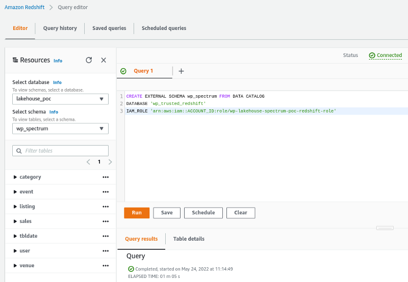

# Redshift Spectrum

## Introduction

In our last post the 2nd part of the series, we walked through the extraction, processing, and creation of some data mart, using the New York City taxi trip data, that is publicly available to do consumption. We've used some of the principal technologies available to Data Analytics inside AWS, such as EMR, Athena, and Glue (Data Catalog and Schema Registry).

In our today's post, we'll show the processing steps using Tickit sample data provided by AWS. The processing phase takes the responsibility to bind the data with its object metastore and schemas provided by AWS Glue Data Catalog and Schema Registry respectively. By using Redshift Spectrum, we'll be able to query processed data from S3, aggregate it and create some Data Mart inside the Redshift.

## Journey

As we are working on since the beginning of this blog series, every AWS resource will be created using terraform, from schemas and table metadata to the EMR cluster to process the data and Redshift, using the Infrastructure as Code (IaC) approach.

Below we will list each used resource and its role in that context.

- Secrets Manager: Used to store the GitHub credential;
- Amazon EMR: The managed Big Data platform for running large-scale distributed data processing jobs, leveraging the strategy to spend fewer computation costs - using Spot instances, in that context, we'll use it with Apache Spark;
- Amazon S3: We'll use S3 buckets to store the data (extracted, processed);
    - Bucket: s3://wp-lakehouse/
        - Folder: raw/ (Receives the original data from Tickit samples provided by AWS.)
        - Folder: trusted/ (Contains the Tickit data with a well-defined schema after processing.)
- AWS Glue Schema Registry: The repository to store and control the schemas and their versions for each object of our Data Lake;
- AWS Glue Data Catalog: We'll use the Glue Data Catalog to have a unified object metastore;
- Amazon Redshift: makes it easier to run and scale analytics without having to manage a data warehouse infrastructure. Get insights running real-time and predictive analytics on all your data across your operational databases, data lake, data warehouse, and thousands of third-party datasets.

### Architecture

The diagram below illustrates the proposed solution's architectural design.


### Environment creation

### AWS Service Creation

To start the deployment we'll validate the infrastructure code developed with Terraform. 
If you doesn't have Terraform installed, here we'll see two approach, installing from the repository and downloading the standalone version.

```sh
# Installing from repository
$ curl -fsSL https://apt.releases.hashicorp.com/gpg | sudo apt-key add -
$ sudo apt-add-repository "deb [arch=amd64] https://apt.releases.hashicorp.com $(lsb_release -cs) main"
$ sudo apt-get update && sudo apt-get install terraform
$ terraform -version
Terraform v1.1.9
on linux_amd64


# Standalone version
$ curl -o terraform.zip https://releases.hashicorp.com/terraform/1.1.9/terraform_1.1.9_linux_amd64.zip && unzip terraform.zip
$ ./terraform -version
Terraform v1.1.9
on linux_amd64
```

Now we'll need to initialize Terraform by running `terraform init`. Terraform will generate a directory named `.terraform` and download each module source declared in `main.tf` file.

There is a useful command to validate the terraform code before the plan `terraform validade`.

Following the best practices, always run the command `terraform plan -out=redshift-stack-plan` to review the output before start creating or changing existing resources.

After getting plan validated, it's possible to safely apply the changes by running `terraform apply "redshift-stack-plan"`. Terraform will do one last validation step and prompt for confirmation before applying.

### Data processing using Amazon EMR

By far, the most popular storage service for a Data Lakehouse is Amazon S3. EMR will allow you to store the data in Amazon S3 and run PySpark applications as you need to process that data. EMR clusters can be launched in minutes. We don't have to worry about node provisioning, internal cluster setup, or other application/framework installation.

One of the most used strategies to achieve cost efficiency is using the purchasing option of Spot instances, that in many cases could represent more than 60% of savings, this will be according to the instance type and their availability within the selected AWS region.

### Data Ingestion

The Tickit data provided by AWS is already available inside the RAW zone, they were manually stored. Each table has its own format and are using a custom separator of columns, bellow table describes each one.


### Data Processing - Trusted Zone

The second step of our data preparation process consists of getting the data from the RAW zone, parsing the data by applying a new well-defined schema with the right data types for each column, and writing this data in parquet file format.

```sh
spark-submit process_data.py -r "s3://wp-lakehouse/raw/" -t "s3://wp-lakehouse/trusted/"
```

In our architecture, we are leveraging the resources of AWS Glue, in this case, our tables will be created inside the AWS Glue Data Catalog by receiving the schema definition from AWS Glue Schema Registry.

Here we could see the schema of all tables that were previously processed.


The list of tables available inside the database `wp_trusted_redshift` by receiving its definition from the schema registry.


### Redshift Spectrum - External tables from S3

Amazon Redshift was built to deliver a massively parallel processing solution that will enable a cloud data warehouse for large-scale data sets solutions. For our deployment, we'll use the Amazon Redshift Spectrum, which is serverless, and it won't be necessary to provision or manage any additional resources.

By using Redshift Spectrum we leverage the power of its processing engine to query data directly from S3 using standard SQL without the need for ETL processing.


After the provisioning of our Redshift Cluster, by looking at the console we can see every cluster detail and we use the JDBC or ODBC URL provided to connect from some external SQL client, but for this scenario, we'll use the Query Editor directly from the Management Console.


With the active Redshift connection, open a new query and execute the command below to create the external schema referencing the Glue Data Catalog database.

```sql
CREATE EXTERNAL SCHEMA wp_spectrum FROM DATA CATALOG 
DATABASE 'wp_trusted_redshift' 
IAM_ROLE 'arn:aws:iam::ACCOUNT_ID:role/wp-lakehouse-spectrum-poc-redshift-role'
```

Since we had the data processing using EMR, our table metadata will be automatically available to Redshift.



Now that we have all tables available inside the Redshift, we'll be able to create the Data Marts inside the schema public, just executing the commands below.

Data Mart 1: `tickit_sales_by_category`

```sql
CREATE TABLE public.tickit_sales_by_category AS (WITH cat AS (
        SELECT DISTINCT e.eventid,
            c.catgroup,
            c.catname
        FROM wp_spectrum.event AS e
            LEFT JOIN wp_spectrum.category AS c ON c.catid = e.catid
    )
    SELECT cast(d.caldate AS DATE) AS caldate,
        s.pricepaid,
        s.qtysold,
        round(cast(s.pricepaid AS DECIMAL(8,2)) * s.qtysold, 2) AS sale_amount,
        cast(s.commission AS DECIMAL(8,2)) AS commission,
        round((cast(s.commission AS DECIMAL(8,2)) / (cast(s.pricepaid AS DECIMAL(8,2)) * s.qtysold)) * 100, 2) AS commission_prcnt,
        e.eventname,
        u1.firstname || ' ' || u1.lastname AS seller,
        u2.firstname || ' ' || u2.lastname AS buyer,
        c.catgroup,
        c.catname
    FROM wp_spectrum.sales AS s
        LEFT JOIN wp_spectrum.listing AS l ON l.listid = s.listid
        LEFT JOIN wp_spectrum.user AS u1 ON u1.userid = s.sellerid
        LEFT JOIN wp_spectrum.user AS u2 ON u2.userid = s.buyerid
        LEFT JOIN wp_spectrum.event AS e ON e.eventid = s.eventid
        LEFT JOIN wp_spectrum.tbldate AS d ON d.dateid = s.dateid
        LEFT JOIN cat AS c ON c.eventid = s.eventid)
```

Data Mart 2: `tickit_sales_by_date`

```sql
CREATE TABLE public.tickit_sales_by_date AS (WITH cat AS (
        SELECT DISTINCT e.eventid,
            c.catgroup,
            c.catname
        FROM wp_spectrum.event AS e
            LEFT JOIN wp_spectrum.category AS c ON c.catid = e.catid
    )
    SELECT cast(d.caldate AS DATE) AS caldate,
        s.pricepaid,
        s.qtysold,
        round(cast(s.pricepaid AS DECIMAL(8,2)) * s.qtysold, 2) AS sale_amount,
        cast(s.commission AS DECIMAL(8,2)) AS commission,
        round((cast(s.commission AS DECIMAL(8,2)) / (cast(s.pricepaid AS DECIMAL(8,2)) * s.qtysold)) * 100, 2) AS commission_prcnt,
        e.eventname,
        u1.firstname || ' ' || u1.lastname AS seller,
        u2.firstname || ' ' || u2.lastname AS buyer,
        c.catgroup,
        c.catname,
        d.year,
        d.month
    FROM wp_spectrum.sales AS s
        LEFT JOIN wp_spectrum.listing AS l ON l.listid = s.listid
        LEFT JOIN wp_spectrum.user AS u1 ON u1.userid = s.sellerid
        LEFT JOIN wp_spectrum.user AS u2 ON u2.userid = s.buyerid
        LEFT JOIN wp_spectrum.event AS e ON e.eventid = s.eventid
        LEFT JOIN wp_spectrum.tbldate AS d ON d.dateid = s.dateid
        LEFT JOIN cat AS c ON c.eventid = s.eventid)
```

Simple query execution to retrieve the data from both data marts.

Data Mart: `public.tickit_sales_by_category`


Data Mart: `public.tickit_sales_by_date`


## Conclusion

In this blog, we've created a scenario to show one of the possible ways to take advantage of many AWS resources in Data Analytics, by using Redsfhit Spectrum we don't need to ingest the entire data from our sources, just using the S3 Bucket as the cheapest and scalable object storage to help the growth process in the Data-Driven Journey. Not only this but in every deployment, we all are thinking about the possible ways to achieve the integration and cost-efficiency to better fit the project needs.

The new paradigm of the Data Lakehouse architecture is arriving to deliver more opportunities to the businesses, where now the range of technology, frameworks, and cost related to Cloud Platform is more attractive than ever.

## We think and we do!
Do you have a business that requires an efficient and powerful data architecture to succeed? [Get in touch](https://www.whiteprompt.com/contact), we can help you to make it happen!
